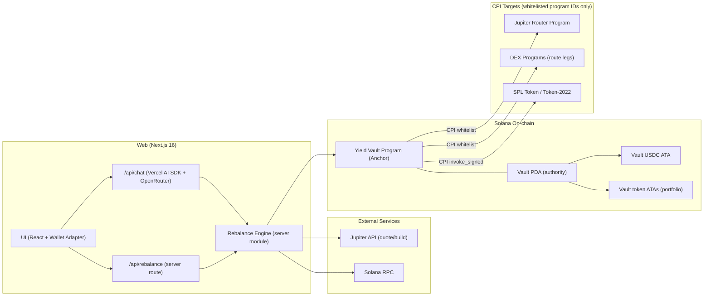

# Yield AI — Agent-safe execution on Solana

[](https://solana.com)
<!-- [](LICENSE) — add LICENSE at repo root, then uncomment -->
<!-- [](INSERT_CI_ACTIONS_URL) -->
<!-- [](INSERT_HACKATHON_URL) -->

> **Yield AI is an agent-safe execution layer for Solana.** A PDA vault with a **program allowlist** lets AI agents put user capital to work **without ever holding the keys**. **Live on mainnet today**, with a working consumer flow that **earns USDC yield on stock positions without selling them**.

[Live app](https://yield-ai-os-sol.vercel.app/) · [Demo video](INSERT_DEMO_VIDEO_URL) · [Deck](INSERT_DECK_URL) · [Hackathon submission](INSERT_SUBMISSION_URL)

---

<!--  -->

## Hackathon / submission

| Name | Role | Contact |
|------|------|---------|
| _INSERT_NAME_ | _INSERT_ROLE_ | _INSERT_TELEGRAM_OR_X_ |

---

## Problem → solution

| # | Problem | How Yield AI addresses it |
|---|---------|---------------------------|
| 1 | **AI + capital = custody risk** — users fear sending funds to an opaque “agent wallet.” | Funds stay in a **vault PDA**; there is **no private key** for the vault authority. |
| 2 | Automation needs **on-chain execution**, not chat-only advice. | A designated **agent** pubkey can drive **whitelisted CPIs**; **withdrawals stay owner-only**. |
| 3 | Open-ended CPIs are dangerous. | **`execute_swap_cpi`** only targets **`allowed_programs`** (max 16), controlled by the owner. |
| 4 | Users want **yield** without necessarily exiting risk assets (e.g. tokenized equities). | **Mainnet** consumer flow: strategy targets, Jupiter routing, and integrations for **USDC yield** while retaining vault-held positions (see live app and technical section below). |

---

## Why Solana

- **Native custody model** — PDAs + `invoke_signed` for non-custodial vaults agents can interact with.
- **Composability** — one vault, many protocols; the allowlist is how automation **safely** opens that surface.
- **Practical automation** — rebalance and agent-driven steps stay viable for a **consumer** product.

---

## What ships today (summary)

- **Anchor vault** — PDA custody, owner withdrawals, allowlisted CPI execution path for the agent.
- **Next.js app** — wallet, vault lifecycle, portfolio, rebalance / convert flows ([live app](https://yield-ai-os-sol.vercel.app/)).
- **AI assistant** — live on-chain context, **explicit confirmation** before execution, `needs_whitelist` when routes need new program IDs.
- **Jupiter** — server-side quote/build for swaps aligned with the vault CPI model.

---

## Tech stack (summary)

| Layer | Stack |
|-------|--------|
| On-chain | Rust · Anchor |
| App & APIs | Next.js · React · TypeScript |
| Wallet | Solana Wallet Adapter |
| AI / automation | Vercel AI SDK · OpenRouter · server modules in `web/` |
| Liquidity / routes | Jupiter API |

---

## Quick start (demo + local)

```bash
git clone INSERT_REPO_GIT_URL
cd INSERT_REPO_DIR_NAME

anchor build

cd web
npm install
npm run dev
```

Env and RPC: see **Environment variables** in the technical section below. Full spec: [what-we-build.md](what-we-build.md).

---

## Roadmap

- [x] PDA vault + owner withdraw + allowlisted agent CPI path
- [x] Next.js dashboard + Jupiter-backed rebalance
- [x] AI chat with confirm-gated tools + allowlist update flow
- [ ] INSERT_POST_HACKATHON_ITEM_1
- [ ] INSERT_POST_HACKATHON_ITEM_2

---

## License

MIT — add a `LICENSE` file at the repository root when you publish the repo publicly.

---

## Technical documentation

The sections below are the **developer-focused** reference (program instructions, architecture diagram, API list, env vars, toolchain).

## 🚀 What it does today

### ⛓️ On-chain vault (Solana / Anchor)
The vault program is the **security boundary**. Funds live in SPL token accounts controlled by a **Program Derived Address (PDA)** tied to the user.

**Instructions**
- **`initialize(agent, strategy, allowed_programs)`**
  - Creates a per-owner vault PDA.
  - Stores the vault owner, the designated `agent` pubkey, the strategy, and an allowlist of CPI program IDs (`allowed_programs`, max 16).
  - Creates the vault USDC ATA (authority = vault PDA).
- **`deposit(amount)`**: Transfers USDC from the owner’s USDC ATA into the vault USDC ATA.
- **`withdraw(amount)`** (**owner-only**): Transfers USDC from the vault USDC ATA back to the owner via `invoke_signed` (PDA authority).
- **`withdraw_spl(amount)`** (**owner-only**): Same as `withdraw`, but for **any SPL/Token-2022 mint** (pulls from a vault-owned token account to the owner’s ATA for that mint).
- **`set_allowed_programs(allowed_programs)`** (**owner-only**): Updates the CPI program allowlist (max 16).
- **`execute_swap_cpi(data)`**: Performs a CPI into a **whitelisted** program ID using `invoke_signed`. Caller must be either `Vault.owner` or `Vault.agent`.

### 💻 Web app (Next.js)
A dashboard to manage the vault and visualize portfolio state.

- **Wallet connection (Solana Wallet Adapter)**: connect + sign transactions (initialize/deposit/withdraw/whitelist updates).
- **Portfolio analytics**: wallet vs vault holdings, allocation charts.
- **Yield display**: server-fetched APR/APY for selected yield tokens (where available).

### 🤖 AI chat (Vercel AI SDK + OpenRouter)
An AI assistant embedded into the UI that is grounded on **live on-chain snapshots** and can propose or trigger actions **only with explicit confirmation**.

- **Context-aware chat**: uses wallet + vault balances, current strategy, and CPI allowlist.
- **Chat-triggered actions**:
  - Rebalance to strategy targets (`rebalance`)
  - Emergency exit: convert everything to USDC (`convert_all`)
  - Individual swap proposals (user-confirmed)
- **Smart fallback**: if a Jupiter route requires additional programs, the system returns `needs_whitelist` + missing program IDs, and the owner can approve them with a one-time `set_allowed_programs` transaction.

---

## 🧩 Architecture (for GitHub)
All production execution logic lives inside `web/` as Next.js API routes + server-side modules.
There is **no separate long-running agent service required** for the MVP (a standalone `agent/` package exists for dev/experiments).



---

## 🔐 Security model (high-level)
- **PDA custody**: vault token accounts are owned by a PDA; no private key exists for the vault authority.
- **Owner-only withdrawals**: `withdraw` and `withdraw_spl` require the `owner` signer.
- **CPI allowlist**: swaps are executed only via CPI into **explicitly whitelisted program IDs** (`allowed_programs`), reducing the “arbitrary instruction” attack surface.
- **Agent is not a custodian**: the `agent` can execute swaps (when allowed), but cannot withdraw funds.
- **Explicit user intent for execution**: chat proposes actions and requires explicit confirmation before running them.

---

## 📦 Repo structure (where things live)
- `programs/yield-vault/`: Anchor program (vault + CPI execution)
- `web/`: Next.js app (UI + API routes + “agent” server modules)
- `client/`: TypeScript smoke tests (initialize/deposit/withdraw)
- `agent/`: standalone Node package (dev/experiments; not required for production MVP)

---

## 🌐 Web API routes (current)
Inside `web/src/app/api/`:
- `POST /api/chat`: AI chat (streaming) + action proposals/execution hooks
- `POST /api/rebalance`: rebalance / convert-all execution endpoint
- `POST /api/cron/rebalance`: same execution endpoint protected by `x-cron-secret`
- `GET /api/vault-history?owner=<pubkey>`: vault deposit/withdraw history summary
- `GET /api/yields`: yield/APY sources (currently includes Onre/ONe; extendable)
- `GET|POST /api/jupiter/prices`: token price fetch via RPC `getAssetBatch` with caching
- `GET|POST /api/jupiter/tokens`: token metadata fetch via RPC `getAssetBatch` with caching
- `GET /api/birdeye/history?address=<mint>&type=4H&time_from=...&time_to=...`: historical price candles (rate-limited)

---

## 🛠️ Development & deployment

### Prerequisites
- Rust + `cargo`; use [rust-toolchain.toml](rust-toolchain.toml) (**1.89.x** for Anchor **0.32** IDL). Run `rustup toolchain install 1.89.0` if prompted; use `rustup override unset` in this repo if an old override hides the toolchain file.
- [Anchor](https://www.anchor-lang.com/docs/installation) CLI **0.32.1** — match [Anchor.toml](Anchor.toml) `anchor_version` (`avm install 0.32.1 && avm use 0.32.1`).

### Solana / Agave CLI and `cargo-build-sbf` (recommended)
Older **platform-tools** can ship an old Cargo version that cannot parse some modern manifests.
Install a current **Agave** release so `cargo-build-sbf` uses a new enough toolchain (e.g. platform-tools **v1.52** with **rustc 1.89**).

```bash
# Optional: remove stale install/cache (only if you are fixing a broken toolchain)
rm -rf ~/.cache/solana
rm -rf ~/.local/share/solana/install

# Install Agave / Solana CLI (stable)
sh -c "$(curl -sSfL https://release.anza.xyz/stable/install)"

solana --version
cargo-build-sbf --version   # expect platform-tools v1.52+ / rustc 1.89+ in the output
```

Then align [Anchor.toml](Anchor.toml) `solana_version` with the version `anchor build` expects. After upgrading CLI: `cargo clean` and `anchor build` from the repo root.

### Build the program

```bash
anchor build
```

Match CLI versions to [Anchor.toml](Anchor.toml) (`anchor_version` / `solana_version`). Example with **avm**:

```bash
avm install 0.32.1
avm use 0.32.1
```

### Deploying to devnet
1. Set cluster + get SOL

```bash
solana config set --url devnet
solana airdrop 2
solana balance
```

2. Keep program ID in sync
- `declare_id!` in `programs/yield-vault/src/lib.rs`
- `[programs.devnet]` in `Anchor.toml`
- keypair at `target/deploy/yield_vault-keypair.json`

3. Deploy

```bash
anchor build
anchor deploy --provider.cluster devnet
```

### Client: devnet smoke test (TypeScript)
The [`client/`](client/) package runs **`initialize`** (Conservative, empty allowlist), **`deposit`**, and **`withdraw`** on devnet.

The script loads the IDL from `target/idl/yield_vault.json`. Run `anchor build` from the repo root if the file is missing or after changing the Rust program.

---

## ⚙️ Environment variables (selected)
The repo contains `.env.example` files inside packages.

**Web (`web/`)**
- `NEXT_PUBLIC_RPC_URL`: Solana RPC endpoint (often a Helius URL for token metadata/prices)
- `NEXT_PUBLIC_PROGRAM_ID`: vault program ID
- `OPENROUTER_API_KEY`: LLM access for chat
- `JUPITER_API_KEY`: Jupiter API key for quote/build
- `CRON_SECRET`: shared secret for `/api/cron/rebalance` (`x-cron-secret` header)

**Standalone agent (`web` server modules / `agent/` package)**
- `AUTHORITY_SECRET_KEY`: authority keypair used for sending transactions (JSON array or base58 secret key)
- `SLIPPAGE_BPS`: swap slippage in bps

---

## Spec
See [what-we-build.md](what-we-build.md) for the MVP architecture spec.
