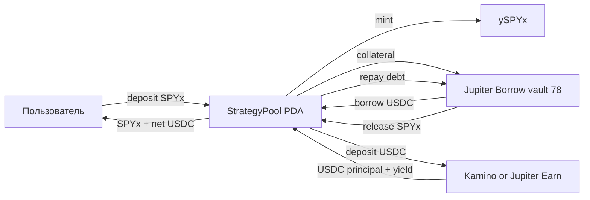

# SPYx Yield Pool: продуктовая и техническая спецификация

Статус: Draft 0.1

Дата расчётов: 11 июля 2026 года

Целевой актив первой версии: SPYx

Receipt token: ySPYx

## 1. Краткое описание идеи

Пользователь вносит SPYx в общий пул и получает ySPYx, представляющий его долю в совокупных активах стратегии.

Пул использует SPYx как collateral в Jupiter Borrow, занимает USDC и размещает USDC в доходных пулах. Базовый маршрут первой версии:

1. Пользователь вносит SPYx.
2. Контракт выпускает ySPYx по текущей стоимости доли.
3. Общий SPYx размещается в Jupiter SPYx/USDC Borrow Vault `78`.
4. Пул занимает USDC с целевым LTV.
5. USDC размещается в выбранном earn-пуле, сначала — Kamino USDC kVault либо более ликвидный Jupiter USDC Earn.
6. При выходе пользователь отправляет ySPYx в redeem queue.
7. Keeper агрегированно выводит USDC, погашает соответствующую часть долга, освобождает SPYx и делает redeem claimable.
8. Пользователь получает свою долю SPYx и чистой USDC-прибыли.

Главная ценность продукта: пользователь сохраняет экономическую экспозицию на SPYx и одновременно получает дополнительный USDC carry, не продавая SPYx.

## 2. Что именно представляет ySPYx

ySPYx — не долговое обещание `1 ySPYx = 1 SPYx`. Это fungible share общего пула, в который входят:

- свободный SPYx;
- SPYx, размещённый как Jupiter collateral;
- свободный USDC;
- withdrawable USDC в earn-протоколах;
- минус актуальный USDC-долг;
- минус начисленные комиссии и обязательства.

Пользователь владеет долей всей корзины. При нормальной работе стратегии redeem возвращает пропорциональную долю SPYx плюс положительный USDC carry. При убытке earn-пула, liquidation или bad debt количество возвращаемых активов может быть меньше ожидаемого.

Такое определение позволяет использовать один общий Jupiter position и один набор earn-позиций для любого числа пользователей, не создавая отдельный кредит и отдельный yield ledger на каждого.

## 3. Почему нужен pooled StrategyPool, а не модификация текущего Vault

Текущий `yield-vault` построен как персональный PDA:

- PDA выводится из `owner`;
- `Vault` хранит одного owner и одного agent;
- owner вносит и выводит токены;
- agent или owner вызывает allowlisted CPI.

Это хорошая custody/execution база для персональных vault, но ySPYx требует другого набора инвариантов:

- один общий asset pool;
- share mint;
- общий Jupiter debt;
- общий NAV;
- redeem epochs;
- performance fee и high-water mark;
- коллективный risk policy;
- отсутствие привилегии одного owner на вывод всех активов.

Поэтому предлагается добавить отдельную сущность `StrategyPool`, а не перегружать семантику существующего `Vault`. Текущие Jupiter и Kamino builders можно использовать как основу клиентских адаптеров, но on-chain поверхность pooled pool должна быть отдельной и более строгой.

Связанные части текущей реализации:

- `programs/yield-vault/src/lib.rs` — персональный Vault, SPL/Token-2022 ingress и CPI gateway;
- `web/src/server/agent/protocols/jupiterBorrow.ts` — Jupiter collateral, borrow, repay и withdraw builders;
- `web/src/server/agent/protocols/kaminoKvault.ts` — Kamino kVault deposit/withdraw builders;
- `web/src/server/agent/protocols/jupiterLendMarkets.ts` — чтение актуальных параметров Jupiter vault;
- `docs/earn-opportunities.md` — текущее состояние интеграций и accounting UI.

## 4. Базовая архитектура



### On-chain компоненты

1. `GlobalConfig` — authorities, pause state и общие лимиты.
2. `StrategyPool` — состояние конкретного SPYx/ySPYx пула.
3. `ySPYx mint` — share token пула.
4. `PoolAuthority PDA` — authority token accounts и внешних protocol positions.
5. `RedeemEpoch` — агрегированная заявка на unwind.
6. `RedeemRequest` — индивидуальная заявка пользователя.
7. `FeeState` — high-water mark и время последнего management fee accrual.
8. Protocol-owned token accounts — SPYx, USDC и receipt tokens.

### Off-chain компоненты

1. Risk keeper — отслеживает Jupiter position, oracle, LTV и health.
2. Epoch keeper — закрывает redeem epochs и исполняет unwind.
3. Rate router — выбирает разрешённый USDC destination по risk-adjusted yield.
4. Reconciler — сверяет on-chain позиции с внутренним состоянием.
5. Alerting — сообщает об oracle staleness, нехватке withdraw liquidity, росте borrow APR и ошибках keeper.

Off-chain keeper может решать, когда вызвать действие, но не должен иметь возможность обойти on-chain лимиты.

## 5. Share accounting и NAV

### 5.1 NAV пула

Для выпуска shares требуется оценивать весь пул в одной единице. Для SPYx-пула удобна единица `SPYx equivalent`:

```text
net_usdc =
    idle_usdc
  + withdrawable_earn_usdc
  - current_jupiter_debt_usdc
  - accrued_protocol_fees_usdc
  - pending_keeper_costs_usdc

nav_spyx =
    liquid_spyx
  + jupiter_collateral_spyx
  + net_usdc / oracle_spyx_price_usdc
```

Если `net_usdc < 0`, отрицательная величина уменьшает NAV. Расчёты должны использовать signed `i128`/`I256`-подобную внутреннюю модель и checked arithmetic.

Для on-chain решения нельзя принимать цену от клиента. Нужен валидированный oracle account с проверками:

- правильный owner и feed;
- publish time;
- confidence interval;
- trading status;
- decimals/exponent;
- явное поведение при stale oracle.

Если oracle stale, новые deposits и финализация обычного epoch останавливаются. Emergency repay должен оставаться доступным настолько, насколько это разрешает Jupiter.

### 5.2 Выпуск ySPYx

Первый депозит:

```text
shares_out = deposit_spyx
```

Последующие депозиты:

```text
shares_out = floor(
    deposit_spyx * total_shares / nav_spyx_before_deposit
)
```

Deposits округляются вниз: пользователь никогда не должен получать больше shares, чем внёс стоимости.

Для защиты от inflation/donation attack первая версия должна использовать один из вариантов:

- virtual shares + virtual assets;
- минимальный bootstrap deposit с permanently locked shares;
- минимальный размер первого депозита и запрет внешних donation accounts в NAV.

Предпочтительный вариант — virtual shares/assets плюс небольшой locked bootstrap.

### 5.3 Redeem

При финализации epoch определяется доля:

```text
q = epoch_shares / total_shares_at_snapshot
```

Keeper выводит и погашает пропорциональную часть стратегии:

```text
earn_usdc_to_withdraw = q * withdrawable_earn_usdc
debt_usdc_to_repay    = q * current_jupiter_debt_usdc
spyx_to_release       = q * jupiter_collateral_spyx

epoch_usdc_out =
    earn_usdc_withdrawn
  + allocated_idle_usdc
  - debt_usdc_repaid
  - fees
  - costs
```

После завершения epoch сохраняются фиксированные значения:

```text
spyx_per_share
usdc_per_share
```

Каждый пользователь делает отдельный `claim_redeem()`. Контракт не итерирует список пользователей и поэтому масштабируется по числу участников.

### 5.4 Защита от double counting

NAV не должен одновременно учитывать:

- underlying USDC в Kamino;
- и полную стоимость receipt token как отдельный актив;
- Jupiter collateral как свободный SPYx;
- Jupiter position NFT как самостоятельную стоимость.

Receipt tokens и position NFT — представление позиции, а не дополнительный экономический актив.

## 6. Redeem epochs

Мгновенный redeem неудобен, потому что для освобождения SPYx нужно:

1. вывести USDC из earn-пула;
2. узнать фактический текущий долг;
3. погасить долг с запасом на rounding/dust;
4. освободить collateral;
5. распределить SPYx и оставшийся USDC.

Вместо глобальной pause используется очередь:

```text
Open
  -> Closed
  -> EarnWithdrawn
  -> DebtRepaid
  -> CollateralReleased
  -> Claimable
  -> Completed
```

Переходы должны быть монотонными и идемпотентными. Повторный keeper call после подтверждённого шага не может повторно вывести или выплатить активы.

### Предлагаемые параметры MVP

- epoch duration: 1 час;
- cancel разрешён до `Closed`;
- целевой срок обычного redeem: до следующего keeper cycle;
- частичный claim запрещён: один request может быть claimed только один раз;
- emergency mode может увеличивать срок и снижать payout до фактически доступного NAV;
- 3–5% USDC debt reserve хранится ликвидно для быстрого repay;
- 5–10% SPYx может оставаться свободным для небольших instant withdrawals в будущей версии.

Для первой версии можно batch-обрабатывать и deposits, если синхронизация NAV и oracle окажется слишком сложной для безопасного мгновенного mint.

## 7. Health factor и risk policy

### 7.1 Где считается health

Jupiter хранит collateral, debt, exchange prices, tick и liquidation state on-chain. Jupiter on-chain program является источником истины и решает, допустима ли операция или liquidation.

Наш keeper читает эти данные через `@jup-ag/lend-read` и рассчитывает/отображает risk off-chain. Приближённая формула:

```text
health_factor ~=
    collateral_usd * liquidation_threshold / debt_usd
```

Формула удобна для UI и алертов, но keeper должен использовать точное декодированное состояние Jupiter, а не только собственную арифметику.

Текущий UI проекта считает `collateralUsd / debtUsd`; перед запуском pooled strategy это нужно заменить на liquidation-adjusted health.

### 7.2 Текущие параметры SPYx/USDC vault 78

Снимок на 11 июля 2026 года:

| Параметр | Значение |
|---|---:|
| Jupiter vault | 78 |
| Collateral | SPYx |
| Debt | USDC |
| Collateral factor | 75% |
| Liquidation threshold | 85% |
| SPYx supply APR | 2.00% |
| USDC borrow APR | 0.81% |
| Borrow fee | 0% |

Ставки и risk parameters не должны быть захардкожены как вечные значения. Keeper и UI читают их live, а on-chain policy хранит собственные более консервативные caps.

### 7.3 Выбор LTV

Начальный health:

```text
initial_health = liquidation_threshold / initial_ltv
```

Падение SPYx до liquidation boundary при неизменном долге:

```text
price_drop_to_liquidation = 1 - initial_ltv / liquidation_threshold
```

| LTV | Initial health | Падение SPYx до liquidation |
|---:|---:|---:|
| 50% | 1.70 | 41.18% |
| 55% | 1.55 | 35.29% |
| 60% | 1.42 | 29.41% |
| 70% | 1.21 | 17.65% |

70% LTV использует 93.3% разрешённой borrow capacity (`70/75`) и оставляет слишком мало места для oracle delay, транзакционных ошибок, weekend gap и задержки вывода из earn-пула.

Если минимальный стартовый health должен быть `1.5`, максимальный LTV равен:

```text
85% / 1.5 = 56.67%
```

Предлагаемая policy:

| Параметр | MVP |
|---|---:|
| Target LTV | 50–55% |
| On-chain max LTV | 56–57% |
| Stop new borrowing | HF < 1.50 |
| Normal deleverage trigger | HF < 1.35–1.45, в зависимости от target band |
| Emergency deleverage | HF < 1.20–1.25 |
| Minimum positive spread | настраиваемый, например 1.5% annualized |

Точные trigger bands нужно backtest-ить на исторических SPY drawdowns и фактической задержке keeper.

### 7.4 Когда «просто вернуть кредит» недостаточно

Нормальный unwind безопасен, если USDC principal ликвиден:

```text
withdraw earn USDC -> repay Jupiter debt -> withdraw SPYx
```

Но полного USDC может не хватить, если:

- earn vault потерял principal;
- withdrawals ограничены;
- borrow APR вырос выше earn APY;
- keeper/RPC не работает;
- oracle stale и Jupiter отклоняет user operation;
- между шагами произошёл price gap;
- возникли rounding/dust или partial-state ошибки.

Поэтому нужны:

- liquid USDC debt reserve;
- insurance reserve;
- два независимых keeper;
- emergency path с repay из резерва;
- крайний путь: продать часть SPYx или atomic unwind через flashloan/swap;
- лимит доли private-credit стратегий;
- fail-closed для новых deposits/borrows и fail-open настолько, насколько возможно, для repay/redeem.

## 8. Текущая доходность

Снимок на 11 июля 2026 года:

| USDC destination | APY | Примерный TVL |
|---|---:|---:|
| Kamino Private Credit USDC | 7.0157% | $7.52M |
| Kamino Neutral Trade USDC Max Yield | около 7.00% | $2.12M |
| Jupiter USDC Earn | 4.46% | $413.9M |

Это live annualized rates, а не гарантированная доходность. Они могут измениться сразу после расчёта.

### Формула стратегии

Для TVL `C`, LTV `L`, SPYx supply rate `R_spyx`, USDC earn rate `R_earn` и borrow rate `R_borrow`:

```text
debt_usdc       = C * L
usdc_earn       = debt_usdc * R_earn
borrow_cost     = debt_usdc * R_borrow
net_usdc_carry  = debt_usdc * (R_earn - R_borrow)
spyx_yield      = C * R_spyx
gross_yield     = spyx_yield + net_usdc_carry
gross_apy       = gross_yield / C
```

В расчётах ниже:

```text
C        = $1,000,000
R_spyx   = 2.00%
R_earn   = 7.015705%
R_borrow = 0.81%
```

### Сценарии для $1 млн TVL

| LTV | USDC debt | Earn income | Borrow cost | Net USDC carry | SPYx yield | Gross annual yield | Gross APY |
|---:|---:|---:|---:|---:|---:|---:|---:|
| 50% | $500,000 | $35,079 | $4,050 | $31,029 | $20,000 | $51,029 | 5.10% |
| 55% | $550,000 | $38,586 | $4,455 | $34,131 | $20,000 | $54,131 | 5.41% |
| 70% | $700,000 | $49,110 | $5,670 | $43,440 | $20,000 | $63,440 | 6.34% |

Переход с 55% на 70% добавляет только около `$9,309` gross yield в год на `$1 млн TVL`, но уменьшает допустимое падение SPYx с 35.3% до 17.6%.

### Более ликвидный вариант

Если вместо Kamino Private Credit использовать Jupiter USDC Earn с 4.46%:

```text
50% LTV gross APY ~= 2.00% + 50% * (4.46% - 0.81%) = 3.83%
```

Это ниже по доходности, но значительно выше по TVL и потенциально проще для liquidity-risk policy. Итоговый router должен максимизировать не APY, а risk-adjusted return с caps на протокол, vault и withdraw liquidity.

## 9. Доход протокола

### 9.1 Что считать прибылью

Протокол не должен брать performance fee с роста рыночной цены SPYx: пользователь и без стратегии владел бы этой экспозицией.

Performance fee берётся с чистого USDC carry:

```text
strategy_equity_usdc =
    withdrawable_earn_usdc
  + idle_strategy_usdc
  - current_jupiter_debt_usdc
  - unreimbursed_keeper_costs

profit_per_share = strategy_equity_usdc / total_yspyx_shares

new_profit = max(
    0,
    profit_per_share - high_water_mark_per_share
) * total_yspyx_shares

performance_fee_usdc =
    floor(new_profit * performance_fee_bps / 10_000)
```

High-water mark не позволяет брать комиссию повторно с уже учтённой прибыли и не позволяет брать fee, пока предыдущий loss не восстановлен.

Fee crystallization выполняется перед deposit, redeem finalization и существенным rebalance.

### 9.2 Management fee

Опциональная management fee начисляется линейно по времени через mint shares в treasury:

```text
fee_shares = ceil(
    total_shares
  * management_fee_bps
  * elapsed_seconds
  / (10_000 * seconds_per_year)
)
```

Fee shares округляются вверх. Частота вызова не должна менять итоговую годовую комиссию сверх оговорённой rounding tolerance.

### 9.3 Предлагаемая модель

- performance fee: 15% от net USDC carry;
- management fee: 0–0.25% TVL в год;
- 20–30% собранной performance fee направляется в insurance и keeper reserve;
- никакой performance fee с SPYx price appreciation;
- никакой комиссии при отрицательном USDC strategy equity.

### 9.4 Доход протокола при $1 млн TVL

При 15% performance fee и 0.25% management fee:

| LTV | Net USDC carry | Performance fee | Management fee | Protocol gross revenue/year | В месяц | User net APY |
|---:|---:|---:|---:|---:|---:|---:|
| 50% | $31,029 | $4,654 | $2,500 | $7,154 | $596 | 4.39% |
| 55% | $34,131 | $5,120 | $2,500 | $7,620 | $635 | 4.65% |
| 70% | $43,440 | $6,516 | $2,500 | $9,016 | $751 | 5.44% |

70% LTV приносит протоколу лишь примерно на `$1,396` в год больше, чем 55%, на каждый `$1 млн TVL`, при существенно худшем liquidation buffer.

При текущей экономике для `$100,000` gross protocol revenue в год потребуется примерно `$13 млн TVL` при 55% LTV. Реальная чистая выручка будет ниже после keeper, RPC, audits, insurance и операционных расходов.

## 10. Предлагаемые accounts

Ниже — логическая схема. Окончательные размеры и layout определяются после прототипа Jupiter decoder.

### `GlobalConfig`

```rust
pub struct GlobalConfig {
    pub admin: Pubkey,
    pub risk_authority: Pubkey,
    pub emergency_authority: Pubkey,
    pub treasury: Pubkey,
    pub paused_deposits: bool,
    pub paused_borrow: bool,
    pub emergency_mode: bool,
    pub bump: u8,
}
```

Admin, risk и emergency roles должны быть разделены. Mainnet authorities — через multisig и timelock для обычных parameter changes.

### `StrategyPool`

```rust
pub struct StrategyPool {
    pub underlying_mint: Pubkey,       // SPYx
    pub share_mint: Pubkey,            // ySPYx
    pub usdc_mint: Pubkey,
    pub authority_bump: u8,

    pub jupiter_vault_id: u16,         // 78
    pub jupiter_position_id: u64,
    pub jupiter_position_mint: Pubkey,
    pub earn_destination: Pubkey,

    pub target_ltv_bps: u16,
    pub max_ltv_bps: u16,
    pub min_health_bps: u16,
    pub emergency_health_bps: u16,
    pub min_spread_bps: i16,

    pub performance_fee_bps: u16,
    pub management_fee_bps: u16,
    pub last_fee_ts: i64,
    pub high_water_mark_usdc_per_share: u128,

    pub active_epoch: u64,
    pub pending_redeem_shares: u64,
    pub last_sync_slot: u64,
    pub flags: u64,
}
```

### `RedeemEpoch`

```rust
pub struct RedeemEpoch {
    pub pool: Pubkey,
    pub epoch_id: u64,
    pub state: RedeemEpochState,
    pub opened_at: i64,
    pub closed_at: i64,
    pub total_shares: u64,
    pub snapshot_total_shares: u64,
    pub spyx_received: u64,
    pub usdc_received: u64,
    pub claimed_shares: u64,
    pub claimed_spyx: u64,
    pub claimed_usdc: u64,
    pub bump: u8,
}
```

### `RedeemRequest`

```rust
pub struct RedeemRequest {
    pub epoch: Pubkey,
    pub user: Pubkey,
    pub shares: u64,
    pub claimed: bool,
    pub bump: u8,
}
```

Для пользователя можно разрешить одну агрегированную request на epoch. Повторный request увеличивает shares checked arithmetic вместо создания массива.

## 11. Предлагаемые instructions

### Governance и initialization

- `initialize_global_config`
- `create_strategy_pool`
- `set_risk_params`
- `set_fee_params`
- `set_earn_destination`
- `pause_deposits`
- `pause_borrow`
- `enter_emergency_mode`
- `transfer_authority`

Изменения LTV, destination и fees должны иметь caps и, после MVP, timelock.

### User flow

- `deposit_spyx(amount, min_shares_out)`
- `request_redeem(shares)`
- `cancel_redeem()` — только до закрытия epoch
- `claim_redeem(min_spyx_out, min_usdc_out)`

`deposit_spyx` использует Token Interface, потому что SPYx является Token-2022 активом. ySPYx лучше начать как простой SPL Token mint без необязательных extensions; composability расширяется только после проверки совместимости.

### Strategy operations

- `sync_strategy_state`
- `deposit_jupiter_collateral`
- `borrow_jupiter_usdc`
- `deposit_earn_usdc`
- `withdraw_earn_usdc`
- `repay_jupiter_usdc`
- `withdraw_jupiter_collateral`
- `rebalance_to_target_ltv`
- `emergency_deleverage`

### Epoch operations

- `close_redeem_epoch`
- `mark_earn_withdrawn`
- `mark_debt_repaid`
- `mark_collateral_released`
- `finalize_redeem_epoch`
- `complete_redeem_epoch`

Названия `mark_*` не означают доверие к keeper: каждый переход обязан проверять фактическое изменение protocol/token accounts и ожидаемые deltas.

### Fee operations

- `crystallize_performance_fee`
- `accrue_management_fee`
- `withdraw_protocol_fees`

## 12. CPI policy

Текущий персональный Vault разрешает agent/owner передавать arbitrary instruction data в allowlisted program. Для pooled TVL этого недостаточно безопасно: allowlist program ID не ограничивает опасную инструкцию внутри разрешённого протокола.

В pooled контракте нужны protocol-specific adapters:

- разрешён только Jupiter vault `78` для SPYx/USDC;
- проверяются supply/borrow mints;
- проверяется Jupiter position NFT и owner PDA;
- проверяются instruction discriminator и направление amount;
- borrow ограничен `max_ltv_bps`;
- withdraw collateral запрещён при непогашенном соответствующем debt, кроме валидного atomic unwind;
- Kamino destination входит в отдельный risk allowlist;
- recipient всех protocol withdrawals — только pool-owned token account;
- fee payer может быть внешним, но не получает authority над активами;
- все writable/signing accounts сверяются с ожидаемым набором;
- arbitrary remaining accounts не должны расширять полномочия CPI.

Предпочтительный путь — отдельные adapter modules с минимальным декодером нужных Jupiter/Kamino accounts. Generic CPI gateway можно сохранить только для персонального Vault, но не для ySPYx pool.

## 13. On-chain risk checks

Keeper не может быть единственной защитой. Контракт должен отклонять операции, нарушающие policy.

Минимальные checks:

1. `borrow_jupiter_usdc` после симуляции не выводит pool выше `max_ltv_bps`.
2. `set_risk_params` не может поставить target выше max или max выше governance cap.
3. Borrow запрещён при stale strategy sync или stale oracle.
4. Borrow запрещён при spread ниже `min_spread_bps`.
5. Earn deposit не может использовать destination вне risk allowlist.
6. Withdrawals из внешних протоколов идут только в pool ATAs.
7. Emergency repay доступен даже при pause deposits/borrow.
8. Обычный admin не может вывести user principal в treasury.
9. Performance fee не может превысить реально положительный USDC equity above HWM.
10. Total claimable по epoch не превышает фактически полученные SPYx/USDC.

Точное чтение Jupiter position является отдельной инженерной задачей. Нужен version-pinned decoder официальных account layouts либо проверенный CPI/read crate. Нельзя полагаться только на переданное keeper число debt или health.

## 14. Keeper design

### Monitoring loop

Keeper каждые 15–30 секунд читает:

- Jupiter collateral и debt;
- exact current position/tick/liquidation state;
- collateral factor и liquidation threshold;
- SPYx oracle price, freshness и confidence;
- USDC borrow APR;
- earn APY;
- withdrawable earn liquidity;
- свободный USDC reserve;
- открытые redeem epochs.

### Действия

```text
if oracle invalid:
    stop deposits and new borrow
    alert

if spread < min_spread:
    stop new borrow
    unwind gradually

if HF < normal threshold:
    withdraw earn USDC
    repay debt to target LTV

if HF < emergency threshold:
    use liquid reserve first
    repay aggressively
    enter emergency mode

if epoch closed:
    process staged unwind
    finalize fixed payouts
```

### Operational requirements

- минимум два независимых keeper deployments;
- idempotency key `(pool, epoch, stage)`;
- transaction simulation перед send;
- confirmation reconciliation;
- priority fee policy;
- retry только transient ошибок;
- алерт при partial completion;
- on-chain last sync slot/time;
- публичный dashboard keeper health.

## 15. Emergency design

Emergency controls должны разделять запреты:

- `pause_deposits` — запрещает новые deposits;
- `pause_borrow` — запрещает новый debt;
- `emergency_mode` — запрещает risk increase, но разрешает withdraw earn, repay debt, close epochs и user claims;
- `full_pause` применяется только к действительно опасным операциям и не должен навсегда блокировать выход пользователей.

Порядок emergency unwind:

1. Использовать idle USDC reserve.
2. Вывести наиболее ликвидный earn allocation.
3. Repay Jupiter debt до безопасного LTV.
4. При необходимости вывести остальные earn allocations.
5. Если USDC shortfall сохраняется, использовать insurance reserve.
6. Последняя мера — продать часть SPYx/использовать flashloan unwind согласно заранее раскрытой policy.

Нельзя обещать пользователю сохранение количества SPYx во всех emergency-сценариях.

## 16. План реализации смарт-контракта

### Этап 0. Зафиксировать решения

Результат: утверждённая спецификация и risk parameters.

- подтвердить, что первая версия поддерживает только SPYx;
- выбрать ySPYx token program;
- утвердить target/max LTV;
- выбрать initial earn destination и allocation caps;
- определить reserve ratio;
- утвердить fee model;
- определить normal/emergency redeem SLA;
- зафиксировать upgrade, multisig и timelock policy.

### Этап 1. Math и core accounts

Результат: Anchor program без внешних CPI.

- `GlobalConfig`, `StrategyPool`, `RedeemEpoch`, `RedeemRequest`;
- virtual shares/assets;
- deposit/mint math;
- request/cancel/claim state machine на mock assets;
- high-water mark;
- management fee accrual;
- pause roles;
- events и error codes.

### Этап 2. Jupiter adapter

Результат: pool-owned Jupiter SPYx/USDC position.

- создать/reuse position NFT для vault `78`;
- deposit SPYx collateral;
- borrow USDC;
- exact debt read;
- repay exact/MAX с dust handling;
- partial и full collateral withdraw;
- on-chain max-LTV enforcement;
- проверка oracle/vault/mints/position owner;
- тесты на mainnet-fork state.

### Этап 3. Earn adapter

Результат: pool-owned USDC earn position.

- Kamino kVault deposit/withdraw;
- receipt accounting без double counting;
- withdrawable liquidity check;
- destination allowlist и allocation cap;
- liquid reserve;
- fallback Jupiter USDC Earn adapter;
- тест loss/shortfall accounting.

### Этап 4. Redeem epochs

Результат: end-to-end pooled exit.

- close epoch;
- aggregate proportional unwind;
- staged transitions;
- fixed `spyx_per_share`/`usdc_per_share`;
- per-user claim O(1);
- partial failure recovery;
- expiry/dust sweep policy;
- большое число пользователей без on-chain iteration.

### Этап 5. Keeper и risk automation

Результат: автоматический rebalance/deleverage.

- exact Jupiter position monitoring;
- spread monitoring;
- oracle monitoring;
- rebalance band;
- normal/emergency deleverage;
- multi-keeper idempotency;
- alerting и runbooks;
- UI/API для current NAV, share price, HF и epoch status.

### Этап 6. Fees и protocol economics

Результат: проверяемая fee crystallization.

- net USDC equity accounting;
- per-share HWM;
- performance fee transfer;
- management fee share mint;
- treasury/insurance/keeper split;
- fee preview в UI;
- тесты deposits/redeems вокруг fee boundary.

### Этап 7. Security hardening

Результат: release candidate.

- удалить arbitrary CPI из pooled surface;
- property/fuzz tests;
- статический анализ;
- независимый security review;
- multisig и timelock;
- upgrade authority plan;
- incident runbook;
- capped beta deployment.

### Этап 8. Mainnet rollout

Предлагаемые caps:

1. Internal mainnet: `$10k` TVL cap.
2. Closed beta: `$50k`.
3. Public guarded beta: `$250k`.
4. `$1M` только после стабильной работы keeper, emergency drill и review.
5. Дальнейшее повышение cap — governance/multisig action с timelock.

Оценка до mainnet candidate без внешнего аудита: примерно 4–6 недель сфокусированной разработки. Аудит и исправления планируются отдельно.

## 17. Тестовый план

### Unit/property tests

- первый и последующие deposits;
- virtual shares и donation attack;
- rounding deposits/withdrawals/fees;
- NAV при положительном и отрицательном net USDC;
- high-water mark без double fee;
- management fee независимо от частоты accrual;
- epoch state monotonicity;
- claim exactly once;
- сумма claims не выше epoch assets;
- отсутствие overflow для максимальных realistic balances;
- dust thresholds SPYx 8 decimals, USDC 6 decimals и Jupiter internal 9 decimals.

### Инварианты

1. Пользователь не может получить больше доли, чем внесённая стоимость.
2. `total_shares` согласован с mint supply.
3. Locked redeem shares нельзя одновременно transfer/redeem повторно.
4. Один request нельзя claim дважды.
5. Epoch не может перейти назад.
6. Treasury не получает user principal через fee path.
7. Debt increase не может нарушить on-chain max LTV.
8. Emergency mode не допускает risk-increasing operations.
9. Receipt assets не учитываются дважды.
10. Любая разрешённая последовательность операций сохраняет accounting conservation с заданной rounding tolerance.

### Integration tests

- Surfpool/mainnet fork с Jupiter vault `78`;
- deposit SPYx -> borrow USDC -> Kamino deposit;
- normal partial redeem;
- full redeem последнего пользователя;
- много пользователей в одном epoch;
- borrow interest между request и finalization;
- earn APY ниже borrow APR;
- Kamino withdraw failure;
- stale oracle;
- SPYx price shock -10%, -20%, -40%;
- keeper crash после каждого stage;
- duplicate transaction/retry;
- Jupiter repay dust;
- недостаточный USDC reserve;
- emergency unwind;
- Token-2022 transfer edge cases.

### Security review checklist

- account owner/discriminator checks;
- PDA seed validation;
- exact mint/token-program validation;
- signer/writable escalation;
- arbitrary CPI/reentrancy;
- stale/confidence oracle handling;
- unchecked arithmetic;
- rounding extraction loops;
- first depositor inflation;
- share price manipulation;
- donation manipulation;
- fee double charge;
- admin/risk/emergency role separation;
- upgrade authority and multisig;
- denial of service через большое число requests;
- safe recovery from partial external-protocol operations.

## 18. Метрики продукта

Пользователю показываются отдельно:

```text
SPYx deposited
ySPYx shares
Share price in SPYx equivalent
SPYx supply APR
USDC earn APY
USDC borrow APR
Net USDC carry
Estimated total APY
Current LTV
Protocol health factor
Liquidation threshold
Estimated liquidation price
Liquid USDC reserve
Redeem epoch/status
Accrued protocol fees
```

Нельзя объединять всё в одно рекламное APY без раскрытия borrow cost, leverage, destination и liquidation risk.

## 19. Открытые решения перед кодом

1. ySPYx должен быть transferable с первого дня или сначала non-transferable/limited?
2. Deposits мгновенные или также epoch-based?
3. Один earn destination или portfolio из нескольких USDC vaults?
4. Какая доля долга остаётся liquid reserve: 3%, 5% или больше?
5. Performance fee 10%, 15% или 20%?
6. Нужна ли management fee на старте?
7. Кто оплачивает keeper и setup rent?
8. Какой maximum redeem SLA раскрываем пользователю?
9. Разрешаем ли emergency продажу SPYx и при каких условиях?
10. Какой exact Jupiter account decoder фиксируем и как обновляем при изменении IDL?
11. Какой oracle используется для NAV mint/redeem и совпадает ли он с Jupiter risk oracle?
12. Какая доля fees направляется в insurance reserve?

## 20. Рекомендация для первой версии

```text
Asset:                  SPYx
Share token:            ySPYx
Target LTV:             50–55%
On-chain max LTV:       56–57%
USDC liquid reserve:    5% debt
Earn route:             capped Kamino + liquid Jupiter fallback
Redeem epochs:          hourly
Performance fee:        15% net USDC carry
Management fee:         0–0.25%
Mainnet initial cap:     $10k
Emergency path:         reserve -> earn withdraw -> repay -> insurance -> SPYx sale last
```

70% LTV не рекомендуется для MVP: дополнительная выручка протокола слишком мала относительно уменьшения liquidation buffer и роста operational risk.

## 21. Источники данных и документация

- Jupiter Borrow overview: https://developers.jup.ag/docs/lend/borrow
- Jupiter Borrow read SDK: https://developers.jup.ag/docs/lend/borrow/read-vault-data
- Jupiter unwind: https://developers.jup.ag/docs/lend/advanced/unwind
- Jupiter oracle rules: https://developers.jup.ag/docs/lend/oracles
- YieldAI Kamino live pools: https://yieldai.app/api/protocols/kamino/pools
- YieldAI Jupiter live pools: https://yieldai.app/api/protocols/jupiter/pools

Перед принятием финансовых решений rates, TVL, vault IDs, oracle и protocol parameters необходимо обновить live.
